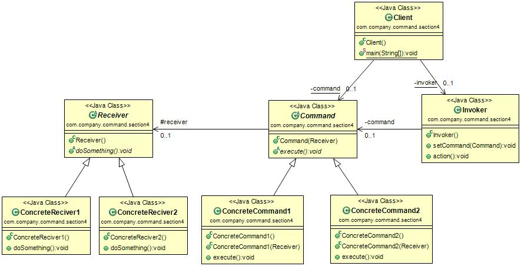

# 命令模式 (Command Pattern) 
定义：Encapsulate a request as an object, thereby letting you parameterize clients with different requests, queue or log request , and support undoable operations.（将一个请求封装成一个对象，从而让你使用不同的请求把客户端参数化，对请求排队或者记录请求日志，可以提供命令的撤销和恢复功能。）    

命令模式 的通用类图如下图：  

从类图中看，我们看到三个角色：

- Receiver接收者角色：该角色就是干活的角色，命令传递到这里是应该被执行的。
- Command命令角色：需要执行的所有命令都在这里声明。
- Invoker调用者角色：接收到命令，并执行命令。

# 命令模式的应用
### 1.命令模式的优点
 * 类间解耦：调用者角色与接收者角色之间没有任何依赖关系，调用者实现功能时只须调用Command抽象类的execute方法就可以，不需要了解到底是哪个接收者执行。
 * 可扩展性：Command的子类可以非常容易扩展，而调用者Invoker和高层次的模块Client不产生严重的代码耦合。
 * 命令模式结合其它模式会更优秀：命令模式可以结合责任链模式，实现命令族解析任务；结合模板方法模式，则可以减少Command子类的膨胀问题。  

### 2.命令模式的缺点 
如果命令很多，Command的子类会膨胀得非常大，这个需要在项目中慎重考虑。  

### 3.命令模式的使用场景
只要你认为是命令的地方就可以采用命令模式，例如，在GUI开发中，一个按钮的点击是一个命令，就可以采用命令模式；模拟DOS命令的时候，当然也要采用命令模式；触发-反馈机制的处理等。